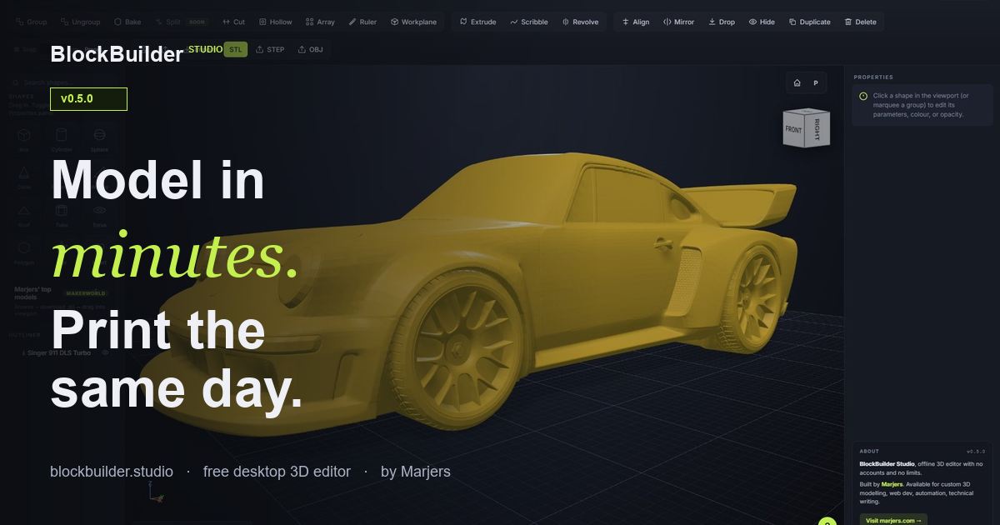

# BlockBuilder Studio

> Offline desktop 3D editor. Drag, snap, print. No accounts, no limits.

A drag-and-drop 3D editor for Windows, macOS, and Linux. Built for the kind
of work 3D printers actually do most days: brackets, jigs, drawer dividers,
GoPro mounts, cosplay props, hex bases. Combines primitives with full CSG
(solid + hole booleans), reads and writes STL / OBJ / STEP, runs entirely on
your machine.

**Free** for personal use. **€12 one-time** commercial licence for for-profit
work.

[**↓ Download v0.5.0**](https://blockbuilder.studio) · [Changelog](CHANGELOG.md) · [Licence](LICENSE)



## What's in the box

- 13 primitive shapes (Box, Cylinder, Sphere, Cone, Pyramid, Wedge, Roof,
  Tube, Torus, Polygon, Star, Heart)
- **CSG** group + hole booleans, reversible until bake
- **Sketch tools**: Extrude, Scribble, Revolve
- **Cut** along an X / Y / Z plane (Bambu-style slice)
- **Hollow** with adjustable wall thickness
- **Array** linear and circular
- **Ruler** with vertex snap
- **Workplane on face** — drop the active workplane on any face
- **Split** into disconnected pieces via union-find
- **STL / OBJ / STEP** export — STEP is AP203 faceted-brep, imports as mesh
  body into Fusion / SolidWorks / FreeCAD
- Undo / redo, save / load, screenshot, dark + light theme

## Stack

- [Electron 32](https://www.electronjs.org/) — desktop wrapper, contextIsolation + sandbox
- [Three.js r170](https://threejs.org/) — viewport rendering (WebGL)
- [three-bvh-csg](https://github.com/gkjohnson/three-bvh-csg) — CSG operations
- [three-mesh-bvh](https://github.com/gkjohnson/three-mesh-bvh) — accelerated raycast for picking
- Zero runtime dependencies in the renderer beyond vendored libs

## Development

```bash
git clone https://github.com/marjers/blockbuilder-studio
cd blockbuilder-studio
npm install                # only Electron + electron-builder
npm run dev                # opens the Electron app
```

The renderer is plain ES modules in `app/*.js` loaded via `index.html`. No
bundler, no build step in dev — edit and reload.

### Building installers

See [`RELEASE.md`](RELEASE.md) for the full per-platform setup (code signing,
notarisation, GitHub Releases automation).

Quick local build:
```bash
npm run dist:all           # Windows NSIS + portable
npm run dist:linux         # AppImage
npm run dist:mac           # DMG (must run on macOS)
```

## Project layout

```
app/                   ES modules loaded by the renderer
  main.js              entry point
  scene.js             Three.js boot + render-on-demand loop
  shape.js             TinkerShape — the wrapper around every mesh
  csg.js               CSG group / ungroup / bake / split
  cut.js               cut-along-plane tool
  hollow.js            shell tool
  sketch.js            extrude / scribble / revolve
  ruler.js             measure tool with vertex snap
  ...
electron/              main process entry (BrowserWindow, IPC)
vendor/                vendored copies of three.js + addons
website/               landing page (deploys to blockbuilder.studio)
keygen/                ECDSA keypair + licence signing scripts (local only)
cloudflare-worker/     licence-issuing webhook handler
build/                 platform icons + NSIS installer hooks
```

## Privacy

Zero telemetry. Zero analytics. Zero cookies. The app never makes a network
request once installed. The website never loads Google Analytics, Meta pixel,
or any third-party tracking script. Your work stays on your disk.

## Licence

Proprietary (free for personal use, €12 one-time for commercial). See
[`LICENSE`](LICENSE) for the full terms.

For licensing questions: <geral@marjers.com>
For bugs: open an issue or write to <geral@marjers.com>

---

Built solo by [Marjers](https://marjers.com). Available for custom 3D
modelling, web development, automation, and technical writing.
